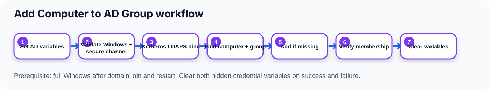

# Design

The self-contained `Scripts\Add-ComputerToADGroup.ps1` runs inside an active ConfigMgr Task Sequence as Local System in full Windows, after domain join and restart.

1. Open `Microsoft.SMS.TSEnvironment`, initialize logging, and read only the custom credential variables `ADGroupUserName` and `ADGroupPassword`.
2. Normalize requested group names and check the computer secure channel.
3. Discover domain controllers in the computer's domain and connect using Kerberos over LDAPS by default. Controllers in the computer's own Active Directory site are tried first, then the remainder; every discovered controller stays available for failover.
4. Read the domain controller's default naming context and find the local computer account and requested groups by `sAMAccountName`, using escaped LDAP filters.
5. Check direct membership; add the computer to the group's `member` attribute only when missing, then verify on the same connection.
6. Retry unresolved transient failures within the configured pass count. Retain permanent failures and completed results rather than repeating those group operations.
7. Log per-group results, dispose LDAP connections, and exit `0` only if every requested group succeeded; otherwise exit `1`.

Membership changes are not transactional: if one group fails, earlier successful additions are not rolled back. Nested/transitive membership and replication to other domain controllers are not verified. Domain controller discovery and searches are scoped to the computer's domain; this is not a cross-forest group-management tool. Site preference is an ordering optimization only: if the local site cannot be determined, discovery falls back to name order and logs a warning.

Credential creation and cleanup belong to native Task Sequence steps, not the script. See [deployment](deployment.md), [logging](logging.md), and [compatibility](compatibility.md). The workflow describes intended behavior, not evidence of a live deployment.
